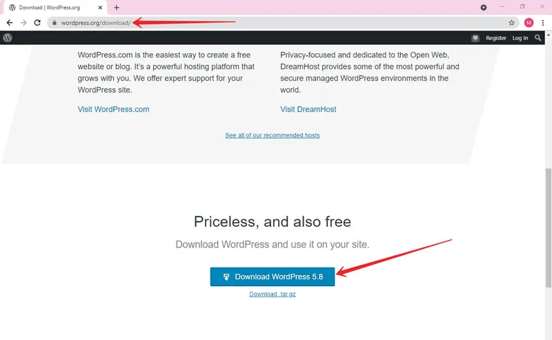
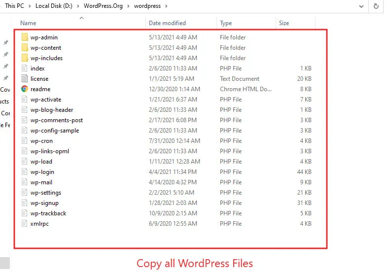
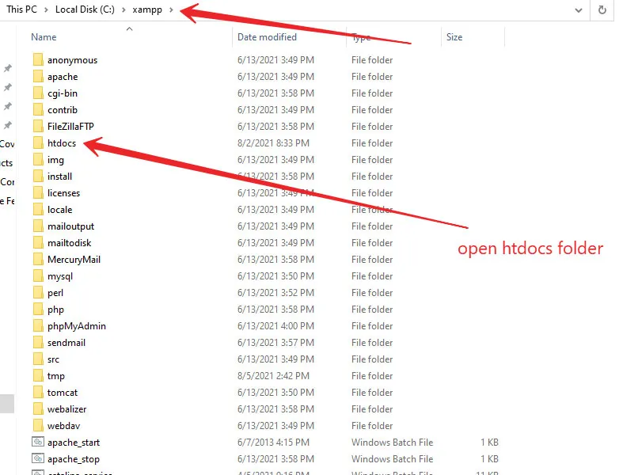
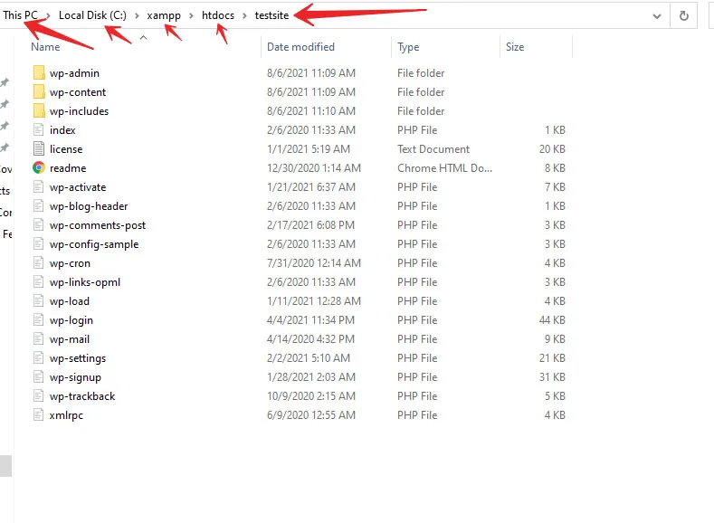
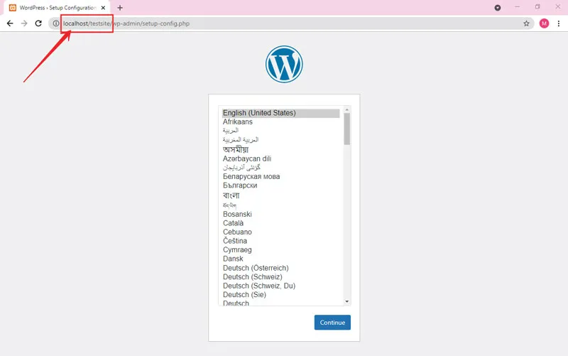

<!-- # brief-8-WordPress -->

<h3>How to install wordpress</h3>

    <h3>Step 1: Download and Extract Latest Version of WordPress from the internet.</h3>   1.1: To do this, you have to go to the WordPress.org website to Download WordPress. Open the link, scroll down the page, and click on the download WordPress button as shown in the image below.
     
    
     
    1.2: After the downloading will complete, WordPress will be in a zip file. So go and extract it on your pc.
     
    
     
    <h3>Step 3: Create a Folder in XAMPP htdocs Folder To Place WordPress Files.</h3>   1.3: After extracting, open the WordPress folder. And copy all the WordPress files. 
     
    
     
    1.4: Now, go to the XAMPP folder then find htdocs folder then open that folder.
     
    
     
    1.5: Now, create a folder named "wordpress" and copy all the files from the WordPress folder.
     
    
     
    1.6: Now, we have been placed WordPress files on the local XAMPP server. It’s time to access WordPress in our browser for installation and configuration.
     
    1.7: Open the browser and go to the localhost/wordpress folder.   <strong>Note:</strong> localhost means this computer and wordpress is the folder that we have been created already.
     
    
     

