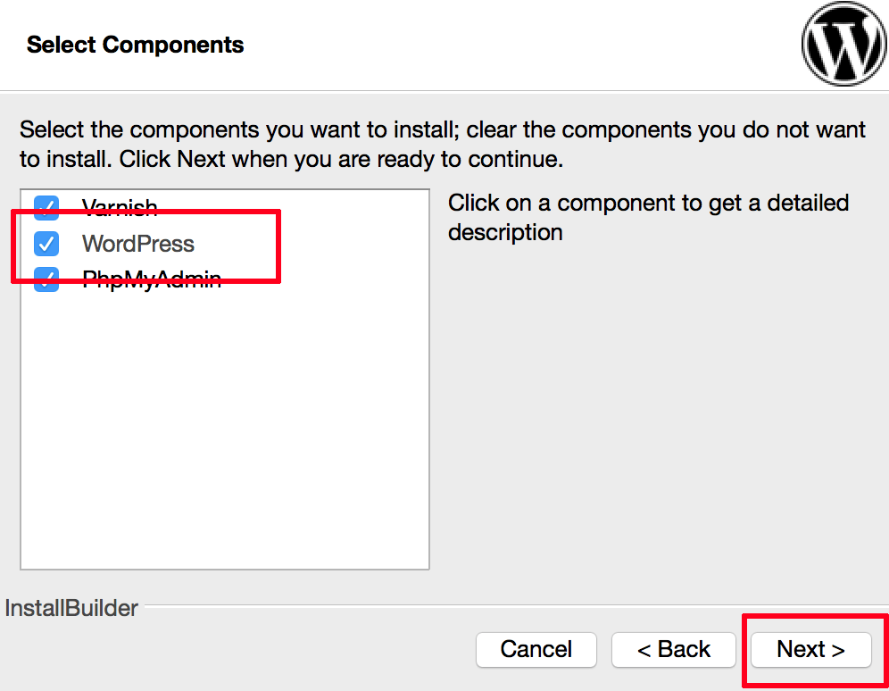
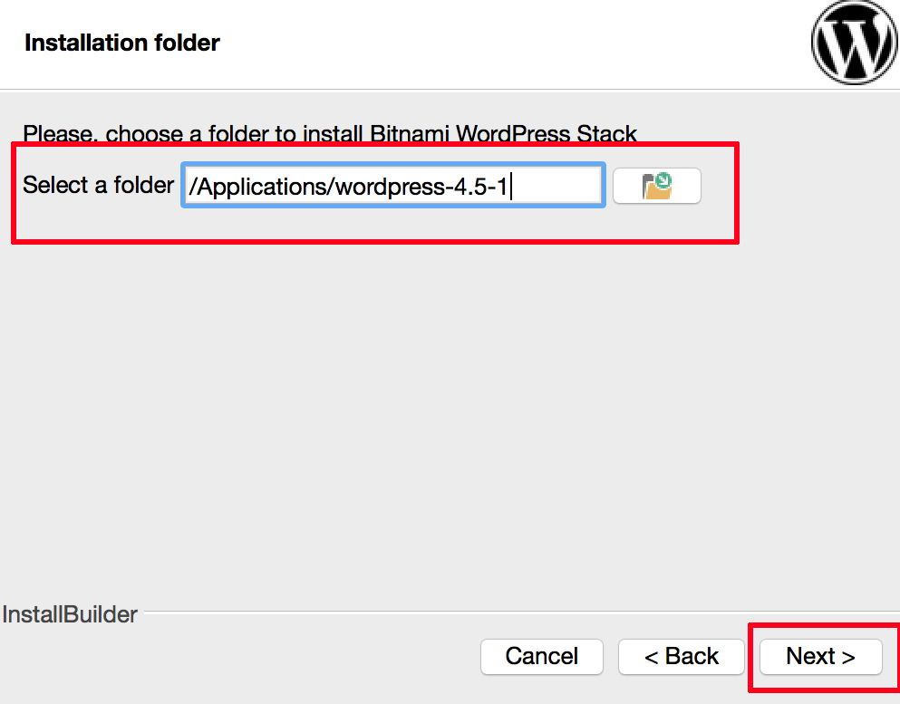
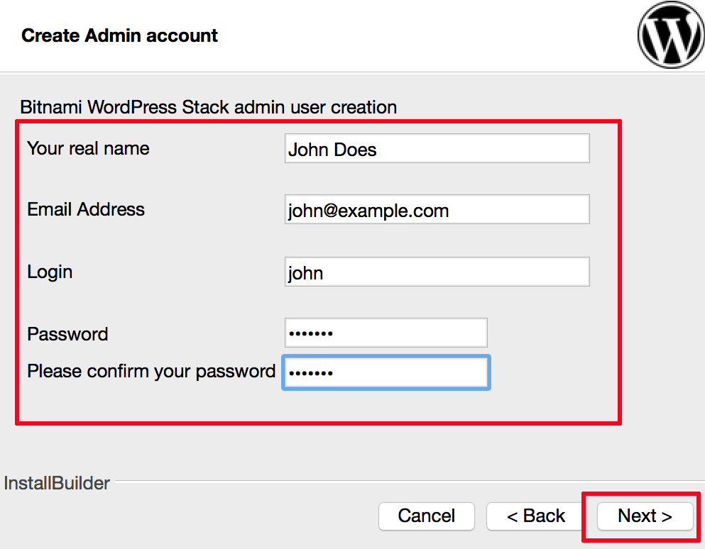
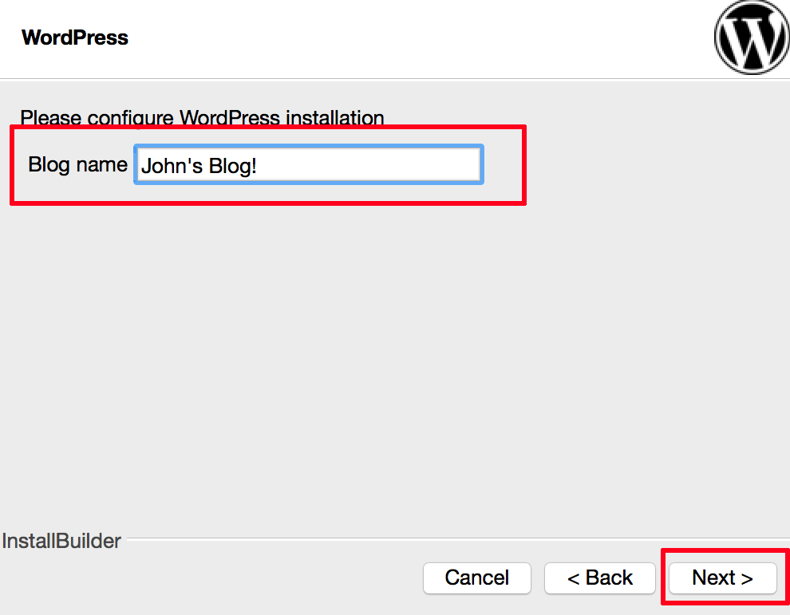
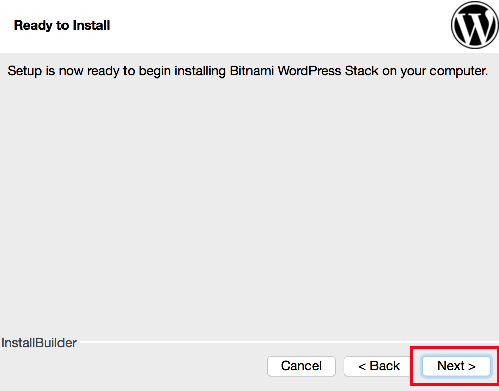
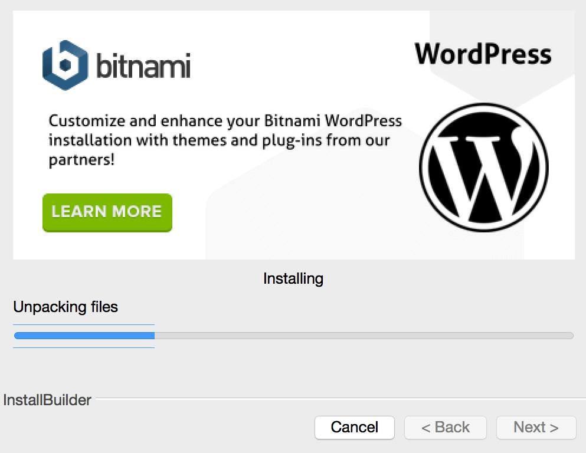
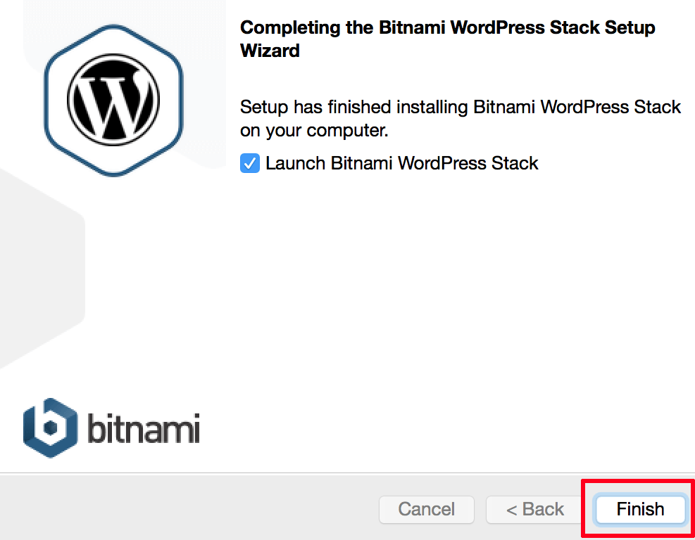

<!-- # brief-8-WordPress -->

<h3>How to install wordpress</h3>

<h5>Step 1: Install WordPress Using The Bitnami WordPress Stack</h5>

    1.1: Begin by downloading the Bitnami WordPress Stack for your platform.
     
    1.2: On Windows begin the installation process by double-clicking the installation executable.
     
    1.3: Select the installation language if prompted. You will be greeted by the welcome screen. Click “Next” to proceed.
     
    
     
    1.4: On the resulting component selection screen, select “WordPress”. You may optionally also choose to install phpMyAdmin and Varnish (TM). Click “Next” to proceed.
     
    
    1.5: Select the installation directory for the Bitnami WordPress Stack. Click “Next” to proceed.
     
    
     
    1.6: Enter your name, email address, WordPress username and WordPress password. These last two values will be needed to log in to the WordPress administration panel in the next step, so note them carefully. Click “Next” to proceed.
     
    
     
    1.7: Enter a name for your WordPress blog (you can always change it later) and click “Next” to proceed.
     
    
     
    1.8: Ready to install .
     
    
     
    1.9: The application will now begin installing to the directory you specified. The process usually takes a few minutes: a status indicator provides a progress update.
     
    
     
    1.10: Once installation is complete, you will see a success message. Check the box to launch the Bitnami WordPress Stack and click “Finish” to complete the installation.
     
    

